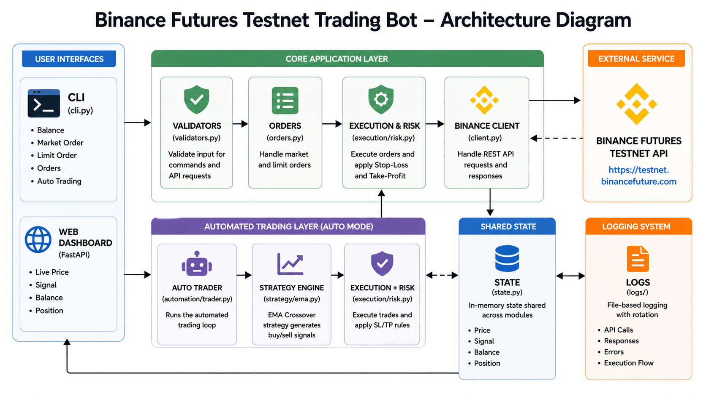

# 📈 Binance Futures Testnet Trading Bot


## Overview

This project is a Python-based trading bot designed for the Binance Futures Testnet. It provides a robust command-line interface (CLI) for executing market and limit orders, alongside an automated trading engine that utilizes an Exponential Moving Average (EMA) crossover strategy. The bot features structured logging, comprehensive error handling, automatic stop-loss and take-profit mechanisms, and a lightweight web dashboard for real-time monitoring.

## Features

* Market and Limit orders
* BUY/SELL support
* CLI interface
* Logging and error handling
* Testnet integration
* Automated trading (EMA crossover)
* Stop-loss and take-profit
* Lightweight web dashboard

## Key Features

| Feature | Description |
|--------|-------------|
| Market & Limit Orders | Place BUY and SELL orders on Binance Futures Testnet |
| CLI Interface | Structured command-line interaction using Click |
| Logging | File-based logging for API calls and errors |
| Auto Trading | EMA crossover strategy for automated execution |
| Risk Management | Stop-loss and take-profit support |
| Web Dashboard | Lightweight FastAPI UI for live monitoring |




## Project Structure

```text
PrimeTrade_assignment/
  bot/
    client.py
    config.py
    orders.py
    state.py
    validators.py
    automation/
      trader.py
    execution/
      risk.py
    strategy/
      ema.py
  logs/
  templates/
    index.html
  app.py
  cli.py
  requirements.txt
  .env.example
```

## Setup Instructions

```bash
# 1. Clone repository
git clone <repository-url>
cd <repository-name>

# 2. Create virtual environment
python -m venv venv
venv\Scripts\activate    # Windows
# source venv/bin/activate  # macOS/Linux

# 3. Install dependencies
pip install -r requirements.txt

# 4. Configure environment variables
# Create a .env file in the root directory:
BINANCE_API_KEY=your_key
BINANCE_SECRET_KEY=your_secret
TESTNET=true

# 5. Run CLI
python cli.py balance

# 6. Run dashboard
python -m uvicorn app:app --reload
```

## Running the Application

### CLI Commands

The primary interface for the bot is the CLI:

```bash
# Check current account balance
python cli.py balance

# Execute a MARKET order
python cli.py market --symbol BTCUSDT --side BUY --quantity 0.001

# Execute a LIMIT order
python cli.py limit --symbol BTCUSDT --side SELL --quantity 0.001 --price 70000

# List active open orders
python cli.py orders

# Start the automated trading loop
python cli.py auto
```

### Running the Web Dashboard

The web dashboard runs as a separate FastAPI process and provides real-time visibility into the automated trader's memory state.

```bash
python -m uvicorn app:app --reload
```

Open a browser and navigate to:

```text
http://127.0.0.1:8000
```

## Example Usage

**Market Order Execution:**
```bash
python cli.py market --symbol ETHUSDT --side BUY --quantity 0.10
```

**Limit Order Execution:**
```bash
python cli.py limit --symbol BTCUSDT --side SELL --quantity 0.002 --price 68500.00
```

## Logging

* Logs are stored in the `/logs` directory.
* Log files rotate automatically and are named using the current date format (`trading_bot_YYYY-MM-DD.log`).
* Logging captures detailed execution flows, including API request payloads, HTTP response codes, and runtime errors.

## Notes and Assumptions

* The codebase currently targets the Binance Futures Testnet.
* Valid Binance Futures Testnet API credentials must be supplied.
* Simulated execution on the testnet may differ in slippage and latency compared to the production environment.

## Future Improvements

* Integrate backtesting capabilities against historical data.
* Expand the strategy engine to support multiple concurrent indicators.
* Enhance the dashboard with historical trade charts.

## Why This Implementation

| Aspect | This Project | Basic Implementation |
|-------|-------------|----------------------|
| Code Structure | Modular and maintainable | Single script |
| Error Handling | Structured and explicit | Minimal |
| Logging | File-based with context | Console only |
| CLI UX | Validated and structured | Raw input |
| Automation | Strategy-driven | Manual execution |
| UI | Integrated dashboard | None |
